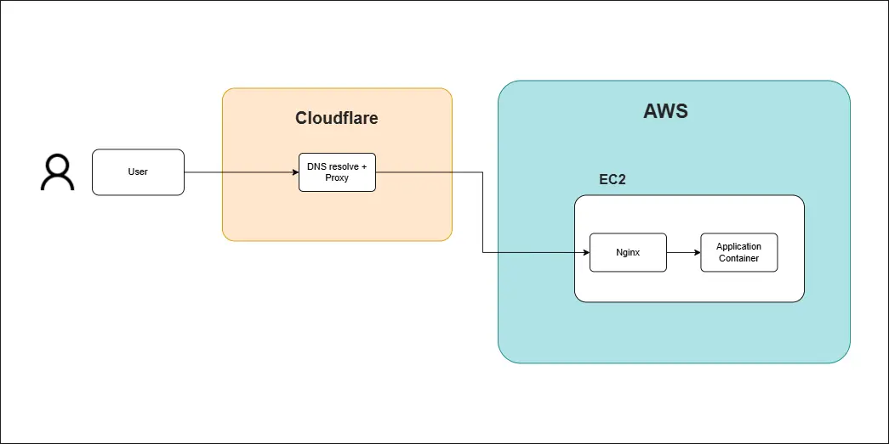

# Java Poker &nbsp;<sub></sub>

[](https://github.com/Safwan-Hossain/Java-Poker/blob/main/Dockerfile)
[](https://github.com/Safwan-Hossain/Java-Poker/blob/main/.github/workflows/deploy.yml)
[](https://github.com/Safwan-Hossain/Java-Poker/actions)
[](https://github.com/Safwan-Hossain/Java-Poker/commits)


> Real time multiplayer poker server with reactive WebSocket gameplay  
> 🎮 **[Play the Demo Now!](https://poker.hossainsafwan.com)**

- A Spring Boot project built for hosting concurrent Texas Hold’em games with reactive WebSockets and clean state isolation using Spring Statemachine.
- Dockerized for easy deployment and runs on EC2 behind Nginx with Cloudflare for secure, low latency access.
- CI/CD is managed through GitHub Actions, automating Docker builds and remote deployment to the live server.

---

[](https://poker.hossainsafwan.com)
> 🚧 This is just the first UI version - expect improvements soon!

---

## 📚 Table of Contents

- [Overview](#-overview)
- [Tech Stack](#-tech-stack)
- [Infrastructure](#-infrastructure)
- [Prerequisites](#-prerequisites)
- [Getting Started](#-getting-started)
- [GitHub Actions Workflow](#-gitHub-actions-workflow)


## 💼 Overview

🎮 **[Play the Demo Now!](https://poker.hossainsafwan.com)**

A backend system for hosting real time multiplayer poker games, built to handle multiple players and game sessions 
simultaneously with high reliability and responsiveness.  

- **CI/CD Automation:** Developed a GitHub Actions pipeline to build and push Docker images, then deploy them to an EC2 instance via SSH for automatic updates
- **WebSocket Architecture:** Implemented reactive WebSocket connections using Spring WebFlux and Project Reactor to enable real-time multiplayer gameplay
- **State Management:** Used Spring Statemachine to isolate game logic and maintain clean session flow across concurrent poker tables
- **Containerization:** Dockerized the entire backend for consistent local development and streamlined cloud deployment
- **Cloud Hosting:** Deployed the application on AWS EC2 with Nginx as a reverse proxy and Cloudflare for secure, low-latency global access

## 🧰 Tech Stack

**Backend**
- **Java 21**
- **Spring Boot 3** 
- **Spring WebFlux** 
- **Project Reactor** 
- **Spring Statemachine** 

**Infrastructure**
- **Docker**
- **GitHub Actions** 
- **AWS EC2**
- **Nginx**


## 🏗️ Infrastructure

- **Cloudflare**  
  - Handles DNS, TLS termination (`wss://`), and protects the EC2 instance by acting as a proxy
- **Nginx**  
  - Acts as a reverse proxy, upgrading WebSocket connections and forwarding them to the server

- **EC2 Instance**  
  - Runs both Nginx and the Java-based poker server (Spring Boot), which manages game state and real-time interactions.

  


> #### ⚠️ This Is Not Enough
> - This setup supports multiplayer, but only on a single EC2 instance with no horizontal scaling
> - All WebSocket traffic is handled locally by Nginx, and failure of the EC2 instance results in full downtime
> - This setup can be refactored into a cloud native architecture using Fargate, service discovery, and dynamic routing for improved scalability and resilience, but it is **out of scope for this implementation**.


## 📦 Prerequisites

To run this project locally, make sure you have the following installed:


- **Java 21** 
- **[WebSocket client ](https://github.com/Safwan-Hossain/Java-Poker-Frontend)** - this app requires a frontend to connect and play.  


> Note: This app uses reactive WebFlux, no servlet container like Tomcat is used


## 🏁 Getting Started

Follow these steps to run the backend locally:

```bash
# Clone the repo
git clone https://github.com/Safwan-Hossain/Java-Poker.git

# Enter the directory
cd Java-Poker

# Run with maven (ensure port 8080 is free)
./mvnw clean install
./mvnw spring-boot:run
```

Once the app is running, connect to the WebSocket endpoint to start or join a game:

- **Create a new game (host):**  
  `ws://localhost:8080/ws/game?playerName={YOUR_NAME}&newGame=true`


- **Join an existing game:**  
  `ws://localhost:8080/ws/game/{TABLE_ID}?playerName={YOUR_NAME}`

> This app does not serve a web page at `http://localhost:8080`. 
> It is backend only and requires a WebSocket compatible frontend.
> You can use [this UI](https://github.com/Safwan-Hossain/Java-Poker-Frontend)
> to connect.

## 🚀 GitHub Actions Workflow

This project includes a CI/CD pipeline in [deploy.yml](.github/workflows/deploy.yml)


On every push to the `main` branch it:

1. Builds the Docker image
2. Pushes the image to Amazon ECR
3. SSHs into the EC2 instance
4. Pulls the latest image
5. Restarts the container with Docker Compose or Docker Run

### Key Environment Values:
- `AWS_REGION`: **\<your region\>**
- `ECR_REGISTRY`: **\<your aws account ID\>**.amazonaws.com
- `IMAGE_NAME`: java-poker
- `TAG`: latest

[//]: # ()
[//]: # (#### Future Plan)

[//]: # ()
[//]: # (The system will transition to a **serverless lobby and dynamic game routing model**:)

[//]: # ()
[//]: # (1. **Players connect via API Gateway WebSocket** to join a lobby)

[//]: # (2. **Lambda** manages lobby state &#40;joins, disconnects, broadcasts&#41;)

[//]: # (3. When the host starts a game, **Lambda launches a Fargate task** for that session &#40;if needed&#41;)

[//]: # (4. The game server runs **`cloudflared`**, creating a secure **Cloudflare Tunnel**)

[//]: # (5. **Lambda sends the tunnel’s DNS** to all players in the lobby)

[//]: # (6. **Players reconnect to that tunnel**, ensuring everyone joins the same server)

[//]: # ()
[//]: # (![diagram]&#40;docs/images/future-infra.webp&#41;)

[//]: # ()
[//]: # ()
[//]: # (>#### 💡 Why Is This Better?)

[//]: # (>- **No one ends up on the wrong server**)

[//]: # (>- **Cloudflare exposes the game securely**)

[//]: # (>- **Scales automatically**: New game servers are launched only when needed and shut down when idle)

[//]: # (>- **Cleaner separation**: Lobby and gameplay logic can be separated)