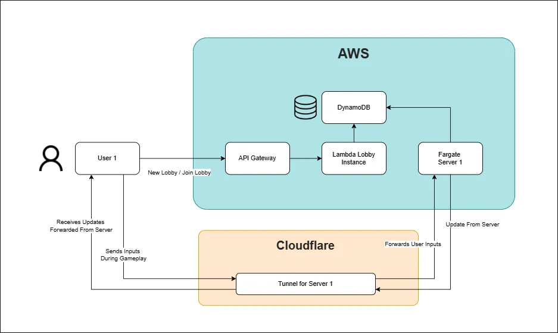

# Java Poker &nbsp;<sub></sub>

[](https://github.com/Safwan-Hossain/Java-Poker/blob/main/Dockerfile)
[](https://github.com/Safwan-Hossain/Java-Poker/blob/main/.github/workflows/deploy.yml)
[](https://github.com/Safwan-Hossain/Java-Poker/actions)
[](https://github.com/Safwan-Hossain/Java-Poker/commits)


> Real time multiplayer poker server with reactive WebSocket gameplay and cloud native architecture  
> 🎮 **[Play the Demo Now!](https://poker.hossainsafwan.com)**

---

[](https://poker.hossainsafwan.com)
> 🚧 This is just the first UI version - expect improvements soon!

---

## 📚 Table of Contents

- [Overview](#-overview)
- [Tech Stack](#-tech-stack)
- [Architecture](#-architecture)
- [Prerequisites](#-prerequisites)
- [Getting Started](#-getting-started)
- [GitHub Actions Workflow](#-gitHub-actions-workflow)


## 💼 Overview


A multiplayer Texas Hold'em engine (backend), built with reactive frameworks and a clean state machine architecture.

### Features:

- Texas Hold'em gameplay
- Live multiplayer
- Supports multiple concurrent game sessions
- Player inactivity handling
- Hosted in the cloud


> 🎮 **[Play the Demo Now!](https://poker.hossainsafwan.com)**
## 🧰 Tech Stack

**Backend**
- **Java 21**
- **Spring Boot 3** with **Spring WebFlux** 
- **Project Reactor** 
- **Spring Statemachine** 
- **Lombok** 
- **Jackson** (JSON serialization)
- **Reactive WebSockets** via `WebSocketHandler`
- **Sinks + Flux** for real time broadcasting

**Infrastructure**
- **Docker**
- **GitHub Actions** 
- **AWS Fargate + ALB** 
  - Handles gameplay (MVP)
  - **Future:** serverless lobby + Cloudflare Tunnel routing


## 📐 Architecture

### 🧱  Design Pattern


- **Reactive Stack**: Built with Spring WebFlux + Project Reactor
- **State Machine Core**: Keeps each game table clean and isolated (no cross table bugs!)
- **Isolated Table Sessions**: Each table runs in its own isolated `GameTableSession` with its own unique state machine
- **WebSocket Communication**: Players connect via WebSockets; updates are broadcast using reactive streams
- **Typed Game Events**: Updates like `PlayerActionUpdate` and `ShowdownResultUpdate` keep clients in sync
- **Domain Driven Logic**: Core gameplay is modeled in `GameLogicHandler` and `RoundFlowManager`


### 🏗️ Infrastructure


#### MVP Setup (Current)

- **Application Load Balancer (ALB)** handles incoming WebSocket connections.
- **AWS Fargate** runs Spring Boot containers to manage game state and real time updates.


>#### ⚠️ This Is Not Enough
> - This setup works for multiplayer, but only with one Fargate instance
> - ALB routes traffic at random across multiple tasks 
> - This means that the ALB may split players across different servers if there are multiple Fargate instances running

#### Future Plan 

The system will transition to a **serverless lobby and dynamic game routing model**:

1. **Players connect via API Gateway WebSocket** to join a lobby
2. **Lambda** manages lobby state (joins, disconnects, broadcasts)
3. When the host starts a game, **Lambda launches a Fargate task** for that session (if needed)
4. The game server runs **`cloudflared`**, creating a secure **Cloudflare Tunnel**
5. **Lambda sends the tunnel’s DNS** to all players in the lobby
6. **Players reconnect to that tunnel**, ensuring everyone joins the same server




>#### 💡 Why Is This Better?
>- **No one ends up on the wrong server**
>- **Cloudflare exposes the game securely**
>- **Scales automatically**: New game servers are launched only when needed and shut down when idle
>- **Cleaner separation**: Lobby and gameplay logic can be separated

## 📦 Prerequisites

To run this project locally, make sure you have the following installed:


- **Java 21** 
- **WebSocket client** - this app requires a frontend to connect and play.  
You can use my [UI here](https://github.com/Safwan-Hossain/Java-Poker-Frontend)

> 💡 Note: This app uses reactive WebFlux, no servlet container like Tomcat is used


## 🏁 Getting Started

Follow these steps to run the backend locally:

```bash
# Clone the repo
git clone https://github.com/Safwan-Hossain/Java-Poker.git

# Enter the directory
cd Java-Poker

# Run with maven (ensure port 8080 is free)
./mvnw clean install
./mvnw spring-boot:run
```

Once the app is running, connect to the WebSocket endpoint to start or join a game:

- **Create a new game (host):**  
  `ws://localhost:8080/ws/game?playerName={YOUR_NAME}&newGame=true`


- **Join an existing game:**  
  `ws://localhost:8080/ws/game/{TABLE_ID}?playerName={YOUR_NAME}`

> This app does not serve a web page at `http://localhost:8080`. 
> It is backend only and requires a WebSocket compatible frontend.
> You can use [this UI](https://github.com/Safwan-Hossain/Java-Poker-Frontend)
> to connect.

## 🚀 GitHub Actions Workflow

This project includes a CI/CD pipeline in [deploy.yml](.github/workflows/deploy.yml)


On every push to the `main` branch it:

1. **Builds the Docker image**
2. **Authenticates with AWS using OIDC and IAM role**
3. **Logs in to Amazon ECR**
4. **Pushes the image to ECR**
5. **The ECS service will automatically pick up the updated image**

### Key Environment Values:
- `AWS_REGION`: **\<your region\>**
- `ECR_REGISTRY`: **\<your aws account ID\>**.amazonaws.com
- `IMAGE_NAME`: java-poker
- `TAG`: latest
